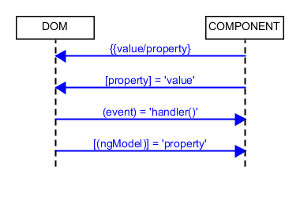

= Databinding

=== Component => DOM

==== Interpolation

[source,js]
<li>Email: {{ user.email }}</li>

==== Property Binding

[source,js]
<input type="email" [value]="user.email">

=== DOM => Component
==== Event Binding
[source,html]
<!-- (event)="function" -->
<button (click)="cookPotato()"></button> <!-- within vanilla element -->
<!-- someEvent defined via @Output of SomeComponent -->
<some-component (someEvent)="onSomeEvent()"></some-component>
