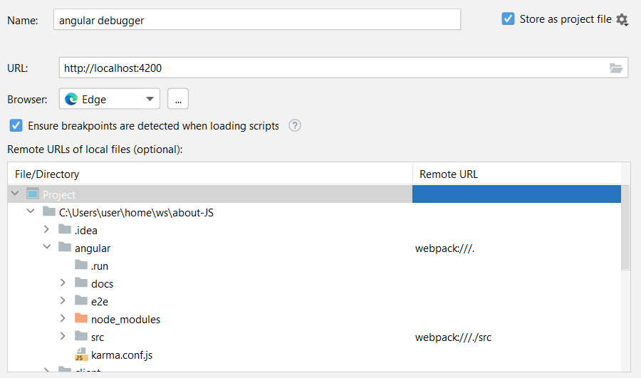

= Angular
:toc:
:toclevels: 4

==== Notes for later
|===
| e2e folder | end-to-end test project
|===

===== Getting Started

[source]
cd "dir containing angular.json"
npm install
npm run start

===== Commands
[cols="10,30"]
|===
| `npm run ng` | call to `ng`
| `ng serve` | compile and run
| `ng generate component <name>` | creates a component in `src/app/<name>`.
| `ng generate service <name>` |
|===

==== User Input
* use ng event bindings to respond to any DOM event.
* bind a DOM event
** surround the DOM event name
** assign a quoted template statement to it
*** <button (click)="onClickMe()">Click me!</button>

==== Pipes
The word uppercase in the interpolation binding, right after the pipe operator ( | ), activates the built-in UppercasePipe.

[source,html]
<h2>{{hero.name | uppercase}} Details</h2>

{empty} +
{empty} +

{empty} +

==== Modules
* Group of Components
* @NgModule with the following parameters:
** `imports`
** `declarations`
** `exports`
** `providers`
** `bootstrap`
** `entryComponents`

{empty} +

==== Modules vs Components

Components control views (html).They also communicate with other components and services to bring functionality to your app.

Modules consist of one or more components.They do not control any html.Your modules declare which components can be used by components belonging to other modules, which classes will be injected by the dependency injector and which component gets bootstrapped. +
Modules allow you to manage your components to bring modularity to your app.

{empty} +

==== @Injectable
Denotes a service which can be provided to (injected into) components. +
{empty} +
provideIn: 'root' +
angular creates a single shared instance, that can be injected into any class.

{empty} +

==== .spec.ts files

The spec files are unit tests for your source files. +
The convention for Angular applications is to have a .spec.ts file for each .ts file.

{empty} +
{empty} +

==== Observables

* have a `.subscribe()` method

==== Debugging

* without IDE
- Browser > Sources > webpack > contains ts files (mapped via source map)
* with IDE (wip)
- npm run start

=== Component Creation

* assuming there are 3 ways to 'call' a component
** `<app-foo>` -> `app.module.ts/declarations` -> `class`
** `app-routing.module.ts` -> `app.module.ts/declarations` -> `class`
** `componentFactory` -> ``app.module.ts/entryComponents` (before `ng9`)-> `class`
