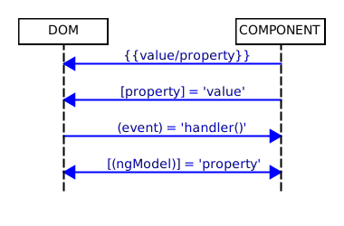

= Databinding

=== Component => DOM

==== Interpolation
Used to output/display some text into the DOM.

[source,html]
<li>Email: {{ user.email }}</li>

==== Property Binding

Used to manipulate attriutes / DOM

[source,html]
<input type="email" [value]="user.email">

{empty} +

=== DOM => Component
==== Event Binding
[source,html]
<!-- (event)="function" -->
<button (click)="cookPotato()"></button> <!-- within vanilla element -->
<!-- someEvent defined via @Output of SomeComponent -->
<some-component (someEvent)="onSomeEvent()"></some-component>

* here `$event` is a reserved keyword.

{empty} +

==== Two-Way Data Binding
* combines
** interpolation
** content value propagation via `event`
