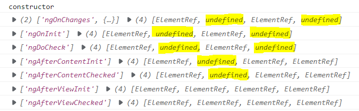

= Template Demo
:toc:
:toclevels:4

{empty} +

==== Clarification

* parent/child means host/nested component.

{empty} +

==== Topics

* Local Reference
* Content (ng-content)
* Lifecycle (hooks)

{empty} +

==== Result

{empty} +

==== Lifecycle (hooks)

[cols="1,3"]
|===
| `ngOnChanges` |
Every change of `@Input` fields of the component .
| `ngOnInit` |
Once after all `@Input` fields of the component are init. +
After constructor.
| `ngDoCheck` |
Every change detection cycle. +
Performing any action will cause this.
| `ngAfterContentInit` |
Once after `<ng-content>` is loaded.
| `ngAfterContentChecked` |
After every change detection cycle targeting `<ng-content>`.
| `ngAfterViewInit` |
Once after the component's view is loaded.
| `ngAfterViewChecked` |
After every change detection cycle targeting the component's view.
| `ngOnDestroy` |
Upon a component's removal from the DOM. +
Place clean up logic here.
|===

