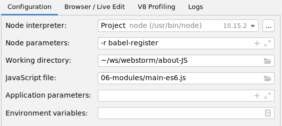

== Modules

Modules are constructs that can be exported /imported. +
There are 3 syntax conventions. +
CJS and ES6 can be used in the same file. +
Modules exported in CJS can be  imported in ES6 and vice versa.

{empty} +

==== CommonJS (CJS)
* used by Node.js
** sometimes choice for server-side js
* not developed for web
** lack async loading

[source,js]
require;
module.exports;

{empty} +

==== AMD
* more complex than CJS
* allows async modules loading
* used by Require.js

{empty} +

==== ES6
* clean syntax of CJS with async loading of ES6
* not yet supported by browsers
** a transpiler like Babel must be used

[source,js]
import;
export;

===== How to configure Babel
* Install babel `npm install --save-dev babel-cli babel-preset-env` +
* Create a `.babelrc` file in project root (_Working directory:_) containing `{ "presets": ["env"] }` +
* Add _Node parameters_ and adjust path to _JavaScript file_ .

|===
| 2+| Import
| Export | CJS | ES6
| CJS |  YES |
| ES6 |  YES |
|===
